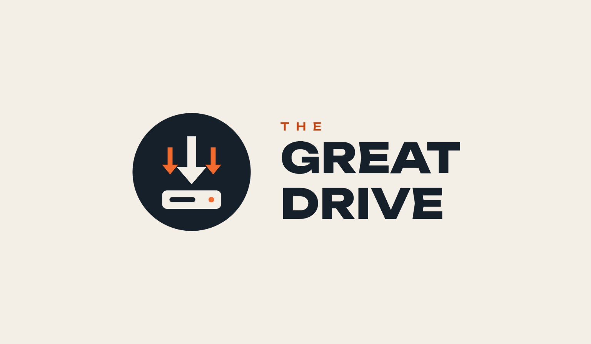

  

<h1 align="center">The Great Drive</h1>

Save what you love — to your phone, Google Drive, or both.

<b>Android 10+</b> · <b>On-device downloads</b> · <b>English / Bahasa Indonesia</b>

English · <a href="README.id.md">Bahasa Indonesia</a>

The Great Drive is an Android app for downloading media, organizing files, and uploading them to Google Drive. Share a link from another app or paste it directly, choose where to save it, and follow the queue. Your last settings are remembered for the next download.

Media extraction, torrent downloads, merging, and uploads run on your phone. You do not need to run a separate server.

## What you can do

| Download | Organize | Stay in control |
| --- | --- | --- |
| Videos, photos, audio, and supported playlists | Save locally, to Google Drive, or both | Keep your preferred quality, destination, and filters |
| Instagram Stories with thumbnails and multi-selection | Browse, search, rename, star, and move Drive files | Pause the queue, cancel, and retry failed jobs |
| Instagram JSON/ZIP imports with category and date filters | Merge a video and audio file with FFmpeg | Review results and share diagnostic logs |
| Magnet links and `.torrent` files | Migrate old download folders with verified copies | Back up history and saved website addresses |

See the [full feature list](docs/i18n/en/FEATURES.md) and [release notes](CHANGELOG.md).

## Start downloading

1. Install a signed APK from your repository’s **Build The Great Drive APK** workflow artifact. Keep the same signing key when updating an existing installation.
2. Open **Download**, paste a link, or share a link/file to The Great Drive from Android.
3. Choose **Local**, **Drive**, or **Both**, then select quality. Leave **Maximum items** empty for no item limit.
4. If needed, sign in to the source website under **Accounts**. Connect your Google account for Drive destinations.
5. Start the download and open **Activity** to follow progress or inspect the result.

Choose **Options → App language** to switch between Bahasa Indonesia and English. The choice is saved; app pages, dialogs, status messages, and offline information use that language. Website content and raw third-party diagnostic text retain their original language.

## A place for everything

| Menu | What is inside |
| --- | --- |
| **Download** | Links, destination, quality, item limit, and the Story picker |
| **Options** | Language, saved download preferences, metadata, dates, and Drive folder ID |
| **Accounts** | Website sessions, Google Drive connection, backups, and device administration |
| **Files** | Instagram imports, local files, torrents, media merging, and folder migration |
| **Activity** | Queue controls, recent results, file links, and error logs |
| **Info** | About, Features, and Changelog, available offline |

Local media is organized under `The Great Drive/site/username/type/` in Android’s Movies, Pictures, or Music collections. Other files go to Downloads. Drive uses the same structure beneath `The Great Drive` in My Drive or your chosen parent folder.

Updating from an older version? **Files → Move local folder / Move Google Drive folder** can copy files from legacy `TGDrive` folders. Keep originals, or remove them only after verification. Local originals are deleted after size and SHA-256 checks; Drive originals go to Trash after size and MD5 checks. Empty old folders remain. Local migration only includes files owned by the current app installation; Google documents and shortcuts are skipped.

## Build your APK

The repository includes a GitHub Actions release workflow. Upload the **contents of this project directory** so that `.github/`, `app/`, and `version.properties` are at the repository root.

1. Configure the existing release signing secrets using [Signing](docs/SIGNING.md).
2. Configure Google Drive using [Google Drive setup](docs/GOOGLE_DRIVE_SETUP.md).
3. Run **Actions → Build The Great Drive APK**.
4. Download the APK and checksum from the artifact named `The-Great-Drive-v<version>-vc<code>-run<run>-<commit>`.

The workflow uses JDK 17, Gradle 8.13, Android SDK 36, and Python 3.11. It builds arm64 and x86_64 APK contents; the included FFmpeg integration requires arm64. Increase `VERSION_CODE` for every upgrade.

The Android package remains `com.tgdrive.mobile` for update compatibility. Keep the existing signing certificate, OAuth client, and `TGDRIVE_*` secret names. Release signing intentionally fails if the expected key is unavailable. Never commit signing keys, passwords, or account cookies.

## Privacy and practical limits

- Website sessions stay on the device. A private temporary cookie file is supplied to the extractor and removed when the job ends. Exported backups exclude login cookies and Google access tokens.
- Source websites and Google Drive receive the requests needed for downloads and uploads. This is not an offline downloader.
- Site support depends on the bundled extractors, the source website, and your account’s access. Login does not guarantee that every URL is supported.
- TikTok posts get a gallery-dl retry when yt-dlp fails, including short share links. TikTok may block both; the retry can use a different quality or omit optional JSON metadata. Read Activity → View error log for both diagnostics.
- Stories and preview URLs can expire. Refresh the Story list when a selected item is no longer available.
- This is an **alpha** release. Keep originals when first trying folder migration and inspect the results on your device.

## Contributing

Keep changes focused and preserve working download, login, and storage flows. Include the app version, Android version, steps to reproduce, and a redacted error log when reporting an issue.

App text is maintained in [`tools/localization.json`](tools/localization.json). Run `python tools/generate_localization.py` after editing translations, then `python tests/check_localization.py`. Complete offline Features and Changelog documents live in `docs/i18n/id/` and `docs/i18n/en/`; the build packages both. See [Localization](docs/LOCALIZATION.md) for the checklist.

Built with [yt-dlp](https://github.com/yt-dlp/yt-dlp), [gallery-dl](https://github.com/mikf/gallery-dl), [Chaquopy](https://chaquo.com/chaquopy/), [FFmpeg](https://ffmpeg.org/), and [libtorrent4j](https://github.com/aldenml/libtorrent4j). Their respective licenses and notices apply to those dependencies.
